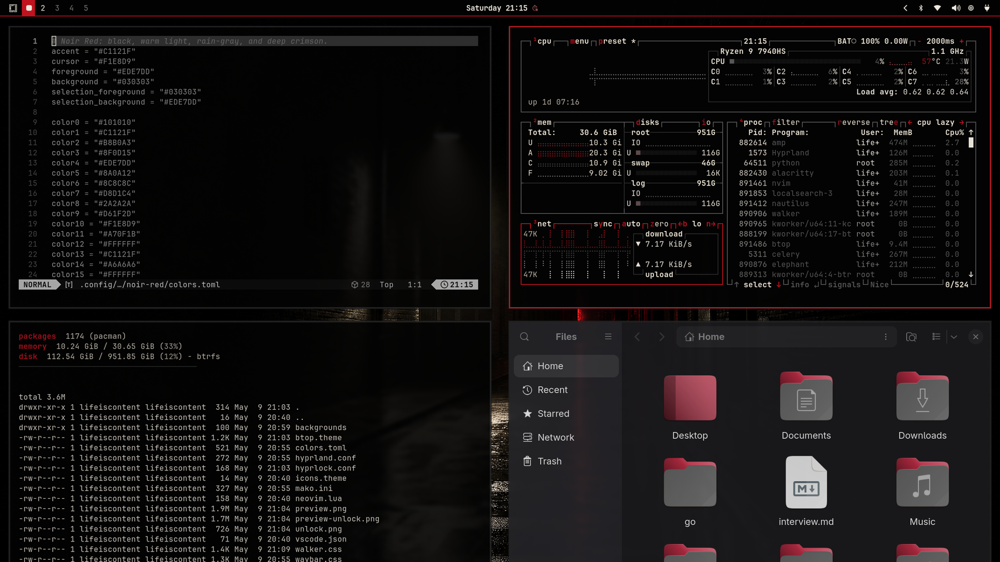

# Omarchy Noir Red Theme

A cinematic noir theme for [Omarchy](https://omarchy.org): rainy city nights, warm off-white light, deep crimson accents, and black negative space.



## Install

Install through Omarchy's extra theme flow:

```bash
omarchy theme install https://github.com/lifeiscontent/omarchy-noir-red-theme.git
```

Or from the Omarchy menu:

```text
Super + Alt + Space → Install → Style → Theme
```

Paste the GitHub repository URL when prompted.

After installation, Omarchy derives the theme name from the repository name by stripping `omarchy-` and `-theme`, so this repository installs as **Noir Red**.

## Included

- Native 4K noir city wallpapers
- Omarchy dynamic color palette
- Waybar, Walker, Mako, Hyprland, Hyprlock, and btop theme overrides
- Neovim and VS Code theme hints
- Preview and lock-screen preview assets

## Wallpaper cycling

After installing, cycle the included wallpapers with:

```bash
omarchy theme bg next
```

## Repository naming

Omarchy recommends naming distributable theme repositories as:

```text
omarchy-[themename]-theme
```

That keeps the installed theme name clean in the theme selector.
